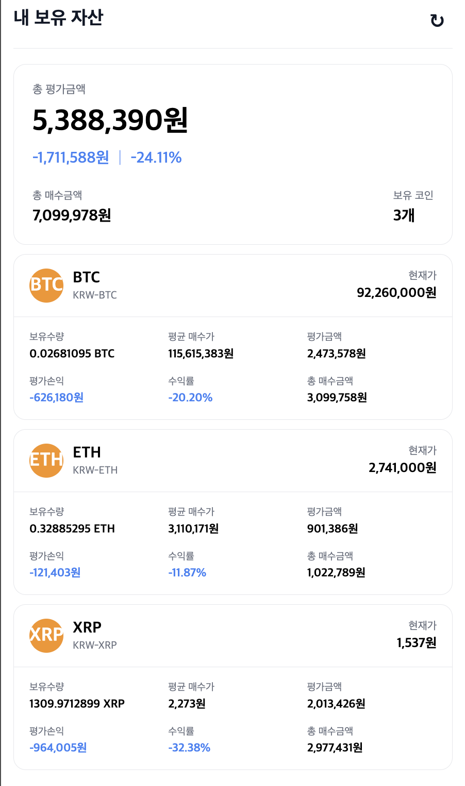
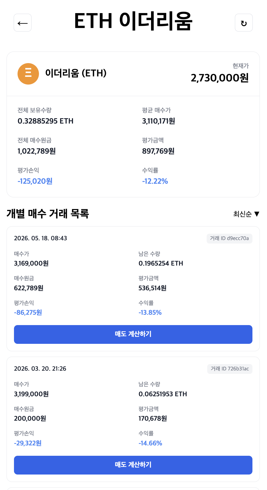
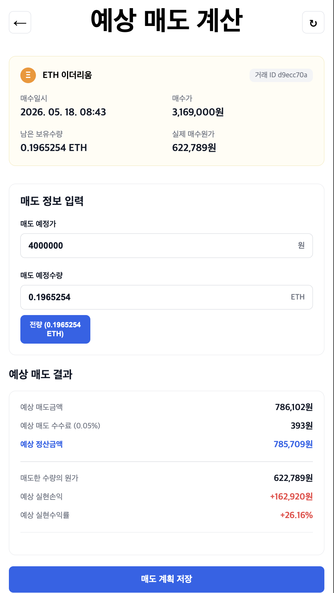
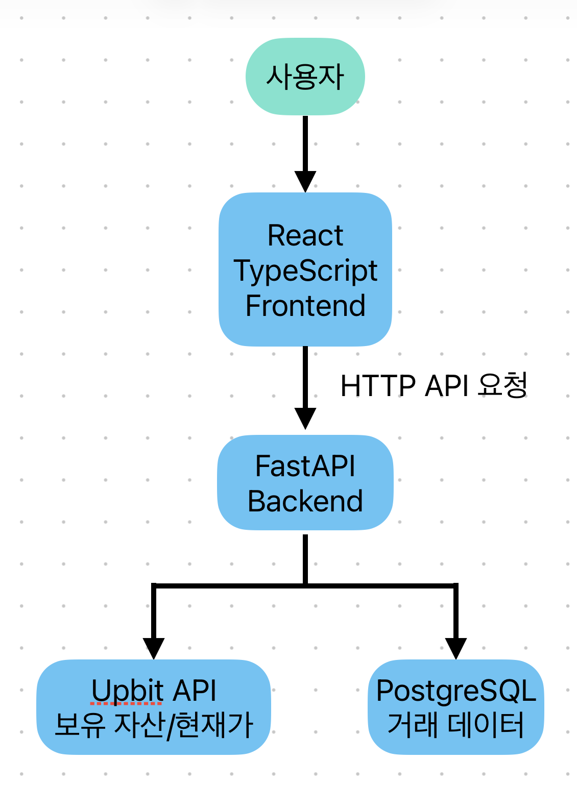
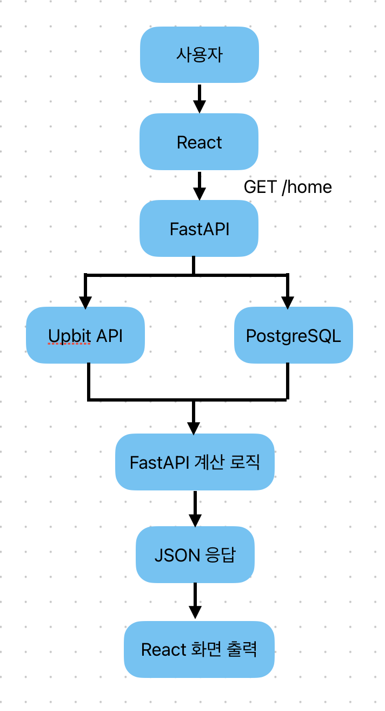

# crypto-lot-tracker

업비트 API와 연동하여 코인별 자산과 개별 거래내역을 추적하고,
예상 매도 결과를 확인할 수 있는 암호화폐 자산 관리 웹 애플리케이션입니다.

### 📱 프로젝트 홈 화면

  

총 평가금액, 보유 코인, 평가손익 등 전체 자산 현황을 한눈에 확인할 수 있습니다.

---

# 📑 목차

- [프로젝트 소개](#프로젝트-소개)
- [프로젝트를 만든 이유](#프로젝트를-만든-이유)
- [프로젝트 화면](#프로젝트-화면)
- [주요 기능](#주요-기능)
- [기술 스택](#기술-스택)
- [전체 시스템 구조](#전체-시스템-구조)
- [데이터 흐름](#데이터-흐름)
- [핵심 계산 로직](#핵심-계산-로직)
- [API 구조](#api-구조)
- [백엔드 구조](#백엔드-구조)
- [어려웠던 점과 해결 과정](#어려웠던-점과-해결-과정)
- [프로젝트를 하며 배운 점](#프로젝트를-하며-배운-점)
- [향후 개선 계획](#향후-개선-계획)

---

# 프로젝트 소개

crypto-lot-tracker는 업비트 API와 연동하여 암호화폐 자산을 관리하는 웹 애플리케이션입니다.

거래내역을 기반으로 코인별 자산 현황과 개별 거래 손익을 계산하고, 예상 매도 결과를 확인할 수 있습니다.

백엔드는 Python과 FastAPI, 프론트엔드는 React와 TypeScript를 사용하여 개발했습니다.

⬆️ [목차로](#toc)

---

# 프로젝트를 만든 이유

업비트에서는 같은 코인을 여러 번 매수하면 평균 매수가만 제공되기 때문에,
각 거래별 손익과 수익률을 확인하기 어렵다는 불편함이 있었습니다.

이러한 불편함을 해결하기 위해 거래내역을 직접 분석하여
개별 거래의 손익과 수익률을 계산하고,
예상 매도 결과까지 한눈에 확인할 수 있는 프로젝트를 만들게 되었습니다.

⬆️ [목차로](#toc)

---

# 프로젝트 화면

### 📄 코인 상세 화면

  

선택한 코인의 평균 매수가, 총 매수금액, 개별 거래내역을 확인할 수 있습니다.

---

### 💰 예상 매도 화면

  

매도 가격과 수량을 입력하여 예상 매도 금액과 손익을 미리 계산할 수 있습니다.

⬆️ [목차로](#toc)

---

# 주요 기능

### 자산 현황 조회

업비트 API에서 보유 자산과 현재가를 가져와 총 평가금액, 총 매수금액, 평가손익, 수익률을 계산합니다.

### 코인별 상세 정보 조회

보유 중인 코인별로 보유수량, 평균 매수가, 총 매수금액, 평가금액과 평가손익을 확인할 수 있습니다.

### 개별 매수 거래 추적

거래내역을 기준으로 각 매수 거래의 매수가, 매수원금, 남은 수량, 평가손익과 수익률을 계산합니다.

### 예상 매도 결과 계산

매도 예정가와 수량을 입력하면 예상 매도금액, 수수료, 정산금액, 실현손익과 수익률을 미리 확인할 수 있습니다.

### 거래내역 저장 및 중복 방지

업비트에서 가져온 거래내역을 PostgreSQL에 저장하며, 거래 UUID를 기준으로 중복 저장을 방지합니다.

⬆️ [목차로](#toc)

---

# 기술 스택

### Backend

- **Python**: 거래내역 처리 및 손익 계산 로직 구현
- **FastAPI**: 계산 결과를 프론트엔드에 전달하는 API 서버 구성

### Frontend

- **React**: 자산 현황, 코인 상세, 예상 매도 화면 구성
- **TypeScript**: 데이터 타입 정의 및 컴포넌트 구현
- **Vite**: 프론트엔드 개발 환경 구성
- **CSS**: 모바일 중심 UI 스타일링

### Database

- **PostgreSQL**: 업비트 거래내역 저장 및 관리

### External API

- **Upbit Open API**: 보유 자산과 거래내역 조회
- **WebSocket**: 코인 현재가 수신

### Development Tools

- **Git / GitHub**: 버전 관리 및 프로젝트 저장소 관리
- **GitHub Desktop**: 변경사항 확인 및 커밋 관리
- **VS Code**: 코드 작성 및 프로젝트 관리

⬆️ [목차로](#toc)

---

# 전체 시스템 구조

프로젝트는 React 기반의 프론트엔드와 FastAPI 백엔드로 구성되어 있으며,
업비트 Open API와 PostgreSQL을 이용하여 데이터를 처리합니다.

  

⬆️ [목차로](#toc)

---

# 데이터 흐름

⬆️ [목차로](#toc)

사용자가 홈 화면을 요청하면 React가 FastAPI에 API를 요청합니다.

FastAPI는 Upbit API에서 보유 자산과 현재가를 조회하고, PostgreSQL에서 거래 데이터를 조회합니다.

조회한 데이터를 기반으로 평균 매수가, 총 매수금액, 평가금액, 평가손익, 수익률을 계산한 뒤 JSON 형태로 반환합니다.

React는 전달받은 데이터를 화면에 출력하여 사용자에게 자산 정보를 제공합니다.

  

---

# 핵심 계산 로직

프로젝트에서는 거래내역을 기반으로 현재 보유 자산과 예상 매도 결과를 계산합니다.

### 1. 보유 자산 계산

- 보유수량 계산
- 평균 매수가 계산
- 총 매수금액 계산

### 2. 평가손익 계산

평가금액 = 현재가 × 보유수량

평가손익 = 평가금액 - 총매수금액

수익률 = 평가손익 / 총매수금액 × 100

### 3. 예상 매도 계산

예상 매도금액 계산

↓

수수료 계산

↓

예상 정산금액 계산

↓

예상 실현손익 계산

↓

예상 실현수익률 계산

⬆️ [목차로](#toc)

---

# API 구조

⬆️ [목차로](#toc)

---

# 백엔드 구조

⬆️ [목차로](#toc)

---

# 어려웠던 점과 해결 과정

⬆️ [목차로](#toc)

---

# 프로젝트를 하며 배운 점

⬆️ [목차로](#toc)

---

# 향후 개선 계획

⬆️ [목차로](#toc)
